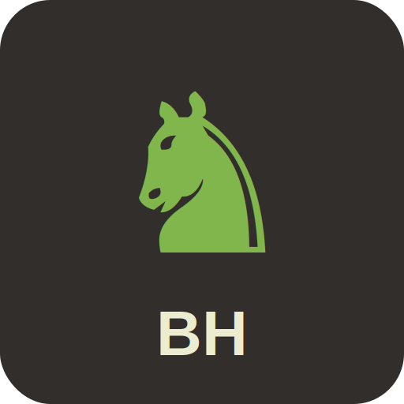

# Bughouse Chess

A complete, self-hostable 4-player Chess Bughouse web application built with React and Node.js. Works seamlessly on desktop, mobile (Android/iOS), and as a Progressive Web App (PWA).



## What is Bughouse?

Bughouse is a popular chess variant where two teams of 2 players each compete on separate boards simultaneously:

- **Team A**: Player 0 (Board 1, White) + Player 2 (Board 2, Black)
- **Team B**: Player 1 (Board 1, Black) + Player 3 (Board 2, White)

When a piece is captured on one board, it goes to the teammate's "piece bank" and can be dropped onto their board instead of making a normal move. The first team to achieve checkmate on either board wins!

## Features

### Core Game Features
- Two interactive chess boards with full chess rules
- Piece banks - captured pieces are transferred to teammates
- Drop pieces from your bank onto the board
- Legal move validation and check/checkmate detection
- Turn-based gameplay with clear visual indicators
- Pawn promotion support
- En passant and castling

### Multiplayer
- Real-time WebSocket communication via Socket.io
- Room/lobby system with unique 6-character room codes
- Supports 4 players + unlimited spectators
- Easy room sharing - just share the room code
- Automatic reconnection handling

### Chat System
- In-game chat during gameplay
- Team-only chat option (private messages to teammate)
- Chat history persists during game session

### Cross-Platform Support
- **Web**: Works in any modern browser (Chrome, Firefox, Safari, Edge)
- **Android**: Install as PWA from browser or access via web
- **iOS**: Add to Home Screen for app-like experience
- Responsive design optimized for all screen sizes
- Touch-friendly controls (tap-to-move and drag-and-drop)

### Progressive Web App (PWA)
- Installable on mobile and desktop
- Offline-capable (cached static assets)
- Full-screen app experience
- Home screen icon

## Quick Start

### Prerequisites
- Node.js 16+ installed
- npm or yarn

### Installation

```bash
# Clone the repository
git clone <repository-url>
cd Bughouse-v1

# Install all dependencies
npm run install:all
```

### Development Mode

Run the server and client separately for development:

```bash
# Terminal 1 - Start the server
npm run start:server

# Terminal 2 - Start the client dev server
npm run start:client
```

Or use the combined command:
```bash
npm run dev
```

- Server runs on: http://localhost:3001
- Client dev server runs on: http://localhost:5173

### Production Mode

```bash
# Build the client
npm run build

# Start the server (serves built client)
npm start
```

The application will be available at http://localhost:3001

## Deployment Options

### Option 1: Direct Deployment

```bash
# On your server
git clone <repository-url>
cd Bughouse-v1
npm run install:all
npm run build
PORT=3001 npm start
```

For production, use a process manager like PM2:
```bash
npm install -g pm2
pm2 start server/index.js --name bughouse
pm2 save
pm2 startup
```

### Option 2: Docker Deployment

```bash
# Build and run with Docker
docker build -t bughouse-chess .
docker run -d -p 3001:3001 --name bughouse bughouse-chess

# Or use Docker Compose
docker-compose up -d
```

### Option 3: Cloud Platforms

#### Heroku
```bash
heroku create your-app-name
git push heroku main
```

#### Railway / Render / Fly.io
Connect your repository and deploy. The app auto-detects the build process.

#### DigitalOcean App Platform
1. Connect your GitHub repository
2. Set build command: `npm run install:all && npm run build`
3. Set run command: `npm start`

### Reverse Proxy (Nginx)

For production with SSL:

```nginx
server {
    listen 80;
    server_name yourdomain.com;
    return 301 https://$server_name$request_uri;
}

server {
    listen 443 ssl http2;
    server_name yourdomain.com;

    ssl_certificate /path/to/cert.pem;
    ssl_certificate_key /path/to/key.pem;

    location / {
        proxy_pass http://localhost:3001;
        proxy_http_version 1.1;
        proxy_set_header Upgrade $http_upgrade;
        proxy_set_header Connection "upgrade";
        proxy_set_header Host $host;
        proxy_set_header X-Real-IP $remote_addr;
        proxy_set_header X-Forwarded-For $proxy_add_x_forwarded_for;
        proxy_set_header X-Forwarded-Proto $scheme;
    }
}
```

## Mobile Access

### Android
1. Open the app URL in Chrome
2. Tap "Add to Home Screen" from the menu, or
3. Accept the install prompt when it appears

### iOS
1. Open the app URL in Safari
2. Tap the Share button
3. Select "Add to Home Screen"

### Desktop
- Chrome/Edge: Click the install icon in the address bar
- Firefox: Use "Install this site as an app" from the menu

## How to Play

1. **Create or Join a Room**
   - Enter your name and create a new room, or
   - Enter a room code to join an existing room

2. **Wait for Players**
   - 4 players are required to start
   - Share the room code with friends
   - Click "Ready" when prepared to play

3. **Gameplay**
   - Make moves on your assigned board (tap/click or drag-and-drop)
   - Captured pieces appear in your teammate's piece bank
   - Drop pieces from your bank by clicking them, then clicking a valid square
   - Watch your partner's board to coordinate strategy!

4. **Win Condition**
   - First team to achieve checkmate on either board wins!

## Project Structure

```
Bughouse-v1/
├── client/                 # React frontend
│   ├── src/
│   │   ├── components/     # React components
│   │   │   ├── ChessBoard.jsx
│   │   │   ├── ChessPiece.jsx
│   │   │   ├── PieceBank.jsx
│   │   │   ├── GameRoom.jsx
│   │   │   ├── WaitingRoom.jsx
│   │   │   ├── Lobby.jsx
│   │   │   ├── Chat.jsx
│   │   │   └── InstallPrompt.jsx
│   │   ├── context/        # React context for state management
│   │   │   └── GameContext.jsx
│   │   ├── App.jsx         # Main application component
│   │   ├── main.jsx        # Entry point
│   │   └── index.css       # Styles
│   ├── public/             # Static assets
│   │   ├── manifest.json   # PWA manifest
│   │   ├── sw.js           # Service worker
│   │   └── icons/          # App icons
│   ├── index.html
│   └── vite.config.js
├── server/                 # Node.js backend
│   ├── index.js            # Express + Socket.io server
│   └── chess.js            # Chess game logic
├── Dockerfile              # Docker configuration
├── docker-compose.yml      # Docker Compose configuration
├── package.json            # Root package with scripts
└── README.md
```

## Technology Stack

- **Frontend**: React 18, Vite
- **Backend**: Node.js, Express
- **Real-time**: Socket.io
- **Styling**: CSS3 with CSS Variables
- **PWA**: Service Worker, Web App Manifest

## Environment Variables

| Variable | Default | Description |
|----------|---------|-------------|
| `PORT` | `3001` | Server port |
| `NODE_ENV` | `development` | Environment mode |
| `ALLOWED_ORIGINS` | `localhost` | Comma-separated allowed CORS origins |

## API Endpoints

| Endpoint | Method | Description |
|----------|--------|-------------|
| `/health` | GET | Health check for monitoring |
| `/api/rooms` | GET | List available rooms |

## WebSocket Events

### Client -> Server
- `createRoom` - Create a new game room
- `joinRoom` - Join an existing room
- `toggleReady` - Toggle ready status
- `makeMove` - Make a chess move
- `dropPiece` - Drop a piece from bank
- `chatMessage` - Send chat message
- `restartGame` - Request game restart
- `leaveRoom` - Leave current room

### Server -> Client
- `roomState` - Room state update
- `gameState` - Game state update
- `gameStart` - Game started
- `gameOver` - Game ended
- `chatMessage` - New chat message
- `moveError` - Move validation error

## Browser Support

- Chrome 80+
- Firefox 75+
- Safari 13+
- Edge 80+
- Mobile browsers (Chrome for Android, Safari for iOS)

## Security Features

- Rate limiting for connections
- Input validation and sanitization
- CORS configuration
- Payload size limits
- Room cleanup for abandoned games

## Troubleshooting

### Connection Issues
- Ensure the server is running
- Check firewall settings for port 3001
- Verify ALLOWED_ORIGINS if using custom domains

### PWA Not Installing
- Ensure HTTPS is enabled (required for PWA)
- Clear browser cache
- Check browser console for manifest errors

### Mobile Display Issues
- Clear browser cache
- Try adding to home screen for better experience
- Rotate device if layout seems off

## Contributing

1. Fork the repository
2. Create a feature branch
3. Make your changes
4. Submit a pull request

## License

MIT License - see [LICENSE](LICENSE) for details.

## Acknowledgments

- Chess.com for design inspiration
- Socket.io for real-time communication
- The chess programming community
